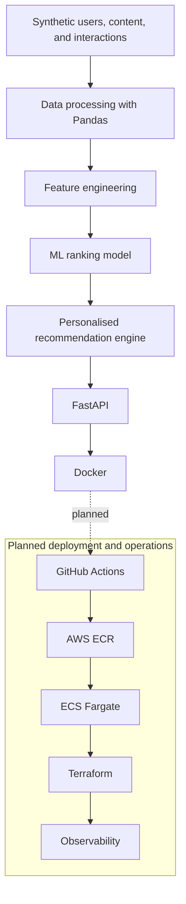

# PulsePlay AI — Sports Recommendation Platform

## Overview

PulsePlay AI is an end-to-end sports content recommendation portfolio project. It demonstrates synthetic data generation and processing, machine-learning ranking, personalised recommendations, API serving, containerisation, and production-style engineering practices.

This is an engineering and learning project, not a commercial service. It has not been used by real customers. The data is synthetic, and the current recommendation quality is experimental rather than production performance.

## Architecture



The GitHub Actions, AWS ECR, ECS Fargate, Terraform, and observability components are planned; they are not implemented or deployed.

## Machine Learning

- **Baseline recommender:** Ranks content using weighted interaction types and a popularity bonus.
- **Ranker V1:** Logistic regression using preference-match and popularity features. ROC AUC: **0.5943**.
- **Ranker V2:** Logistic regression with preference, popularity, and historical user/content behavior features. ROC AUC: **0.6091**.
- **Ranker V3 experiment:** Adds historical user-by-sport and user-by-content-type features. ROC AUC: **0.5982**.

Ranker V2 is retained for serving because it had the strongest measured ROC AUC of these versions. V3's richer feature set did not automatically improve performance; model selection was based on measured results rather than feature count. The synthetic data and experimental scores are not evidence of production performance.

## Recommendation Evaluation

The offline chronological Top-10 evaluation of Ranker V2 reports:

| Metric | Result | What it measures |
| --- | ---: | --- |
| Precision@10 | 0.0205 | Share of the top 10 recommendations that are relevant. |
| Recall@10 | 0.1114 | Share of relevant unseen items retrieved in the top 10. |
| NDCG@10 | 0.0582 | Ranking quality, giving more credit to relevant items near the top. |
| Users evaluated | 693 | Users with eligible later positive interactions and unseen relevant items. |

These results show that ranking quality still needs improvement. They are offline measurements on synthetic data, not user or business outcomes.

## Leakage Prevention

Raw current-interaction outcomes such as `event_type`, `watch_time_seconds`, and the current `watch_percentage` are not used as model input features when they would reveal the outcome being predicted. `event_type` is used to derive the engagement label, and watch behavior contributes only to historical aggregates built from earlier timestamps. Ranker V2 and V3 use chronological train/test splits, and the recommendation evaluation builds profiles and candidate features from history before its time cutoff.

## API

The FastAPI service loads `models/ranker_v2.joblib` and its required data at startup.

| Method and path | Behavior |
| --- | --- |
| `GET /health` | Returns service status and the selected model name. |
| `GET /recommendations/{user_id}` | Returns up to 10 unseen content recommendations for a known user. |

Example user: `USR-0497`.

- A known user request returns HTTP **200**.
- An unknown user returns HTTP **404** with a not-found detail.

## Docker

Build the image from the repository root:

```bash
docker build -t pulseplay-ai:1.0 .
```

For local-only access, bind the published port to loopback:

```bash
docker run --name pulseplay-api -p 127.0.0.1:8080:8080 pulseplay-ai:1.0
```

Open the health endpoint or interactive API documentation:

- [http://127.0.0.1:8080/health](http://127.0.0.1:8080/health)
- [http://127.0.0.1:8080/docs](http://127.0.0.1:8080/docs)

## Tech Stack

- Python 3.12
- Pandas
- scikit-learn
- FastAPI and Uvicorn
- Docker
- Git and GitHub

**Planned:** GitHub Actions, AWS ECR, AWS ECS Fargate, Terraform, and Amazon CloudWatch.

## Repository Structure

```text
.
├── data/                         # Synthetic source, processed, and ranking-feature CSVs
├── models/                       # Serialized Ranker V1, V2, and V3 models
├── src/
│   ├── api/main.py               # FastAPI health and recommendation endpoints
│   ├── data/                     # Synthetic data generation and processing
│   ├── evaluation/               # Offline chronological recommender evaluation
│   ├── features/                 # Historical behavior and V3 feature engineering
│   ├── ranking/                  # Ranker training and diagnostics
│   └── recommendation/           # Popularity baseline and personalized recommender
├── Dockerfile                    # Container image and API startup command
└── requirements.txt              # Python dependencies
```

The API currently serves with `models/ranker_v2.joblib` and reads `data/ranking_features_v2.csv` and `data/content.csv`.

## Engineering Decisions

- Retained Ranker V2 over V3 based on the measured ROC AUC results.
- Built behavioral features from historical interactions only, rather than current outcomes.
- Loaded the serialized model for inference at API startup instead of retraining per request.
- Packaged the API as a Docker image for reproducible local execution.
- Used seeded synthetic data generation to make the example dataset reproducible.
- Returned a controlled HTTP 404 for unknown users.

## Roadmap

- [ ] GitHub Actions CI
- [ ] Automated Docker build
- [ ] AWS ECR
- [ ] ECS Fargate
- [ ] Terraform IaC
- [ ] CloudWatch logging and metrics
- [ ] Health checks
- [ ] Security hardening
- [ ] A/B testing and experimentation
- [ ] Improved ranking models